

# [MeiloX](https://github.com/NEORUAA/MeiloX)

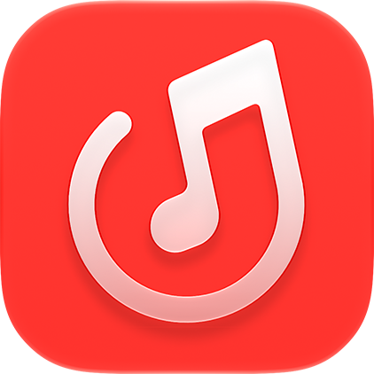

### 一个基于 Mei 改造的高仿 Apple Music 风格网易云音乐 Android 客户端

---

## 项目简介

MeiloX 是一个基于 [Mei](https://github.com/ljyh223/Mei) 改造的第三方网易云音乐客户端，使用 **Jetpack Compose** 构建，尝试把 iOS 27 的层次感、液态玻璃和沉浸式播放器体验带到 Android 上。

项目重点放在三个方向：

- 用 iOS 风格的页面结构重新组织网易云音乐内容；
- 用 Liquid Glass、动态背景和专辑封面让播放过程更有沉浸感；
- 保留网易云音乐的搜索、歌单、歌词和个人资料等使用习惯。

> MeiloX 是非官方的个人开源项目，不隶属于网易云音乐或 Apple；项目本身不提供音乐资源，音乐内容及相关版权归其权利人所有。

## 功能概览

- 网易云音乐 Cookie 登录与账号信息展示；
- 搜索歌曲、专辑、歌手和歌单；
- 播放队列、随机播放、循环播放和定时停止；
- 播放历史、喜欢的音乐、歌单管理和本地收藏；
- 专辑详情、歌手主页、每日推荐及 FM 播放；
- 逐字歌词与多语言歌词展示；
- Apple Music 风格全屏播放器、迷你播放器和歌词浮窗；
- 浅色/深色主题、动态专辑背景和 Liquid Glass 交互效果。

功能仍在持续调整中，实际可用范围会随版本和网易云音乐接口状态变化。

## 开源致谢

MeiloX 的界面、歌词和底层能力受以下项目启发或直接使用其开源组件，感谢所有贡献者：

- [Mei](https://github.com/ljyh223/Mei)：上游 Android 项目与基础能力；
- [MeloX](https://github.com/youshen2/MeloX)：iOS 版参考实现与产品方向；
- [amll-ttml-db](https://github.com/Steve-xmh/amll-ttml-db)：高质量逐字歌词数据；
- [accompanist-lyrics-ui](https://github.com/6xingyv/accompanist-lyrics-ui)：歌词模型与渲染组件；
- [AndroidLiquidGlass / Backdrop](https://github.com/Kyant0/AndroidLiquidGlass)：Compose Multiplatform 流体玻璃效果。

## 许可证与第三方声明

MeiloX 主体代码以 [GNU General Public License v3](LICENSE) 发布。MeiloX 是 Mei 的衍生项目，相关上游代码和参考实现仍受其原始版权与许可证约束；第三方库、模型、脚本、字体和视觉素材不因 MeiloX 使用 GPLv3 就自动转为 GPLv3。

重点声明如下：

- [Mei](https://github.com/ljyh223/Mei) 的上游代码遵循 Apache License 2.0；
- [MeloX](https://github.com/youshen2/MeloX) 的相关参考代码遵循其项目的 GPLv3 条款；
- [AndroidLiquidGlass / Backdrop](https://github.com/Kyant0/AndroidLiquidGlass) 相关依赖遵循 Apache License 2.0；
- [amll-ttml-db](https://github.com/Steve-xmh/amll-ttml-db) 与 [accompanist-lyrics-ui](https://github.com/6xingyv/accompanist-lyrics-ui) 遵循各自仓库公布的许可证和署名要求；
- BeatNet 模型、音频指纹运行时、ONNX Runtime、PV Tool 衍生内容及其它随项目分发的组件，遵循其各自的许可证、版权声明和再分发限制。

完整的来源、版权归属、许可证链接和特殊再分发要求请阅读 [THIRD_PARTY_NOTICES](THIRD_PARTY_NOTICES)。其中 `res/font/sf_pro.ttf` 仅作为个人项目资源使用；请勿从构建产物中单独提取或再分发，公开发布构建版本前请重新核对 Apple 的字体许可条款。

## 软件界面预览

以下预览来自 [`screenshot/2026-08-22`](./screenshot/2026-08-22/)，同时展示浅色、深色和播放器界面。

### 浅色界面

<table>
  <tr>
    <td>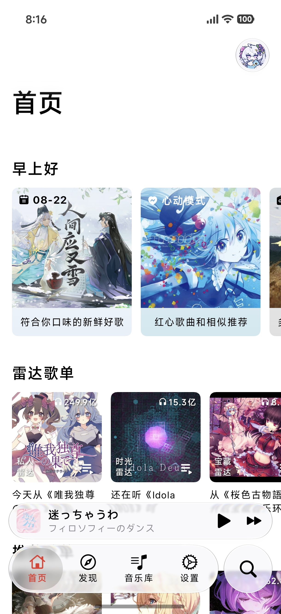</td>
    <td>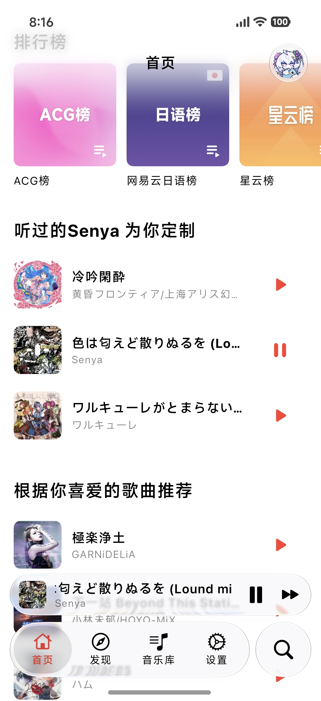</td>
    <td>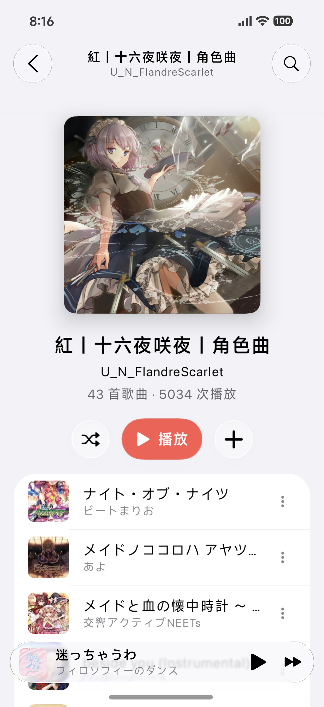</td>
    <td>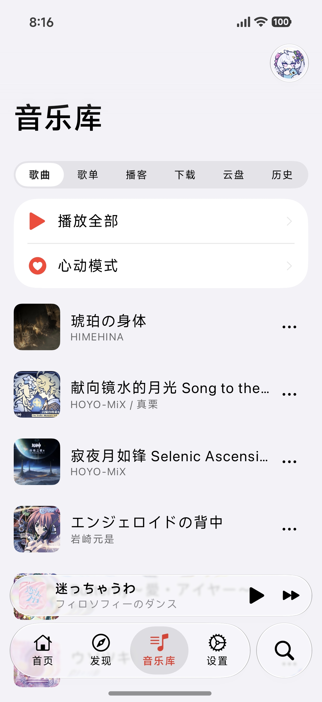</td>
  </tr>
  <tr>
    <td>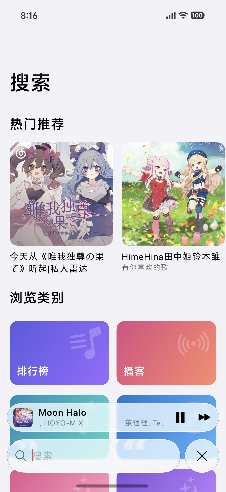</td>
    <td>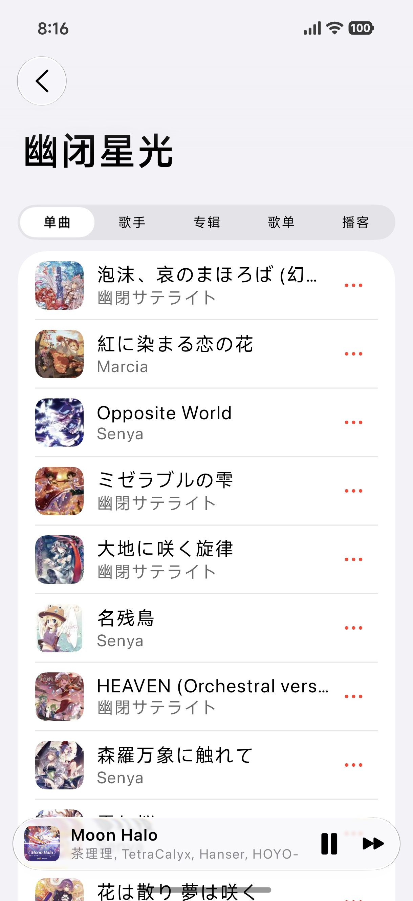</td>
    <td>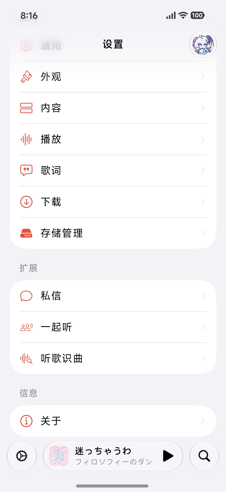</td>
    <td>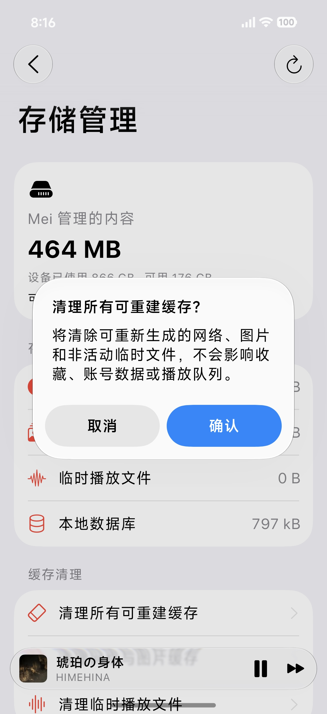</td>
  </tr>
</table>

### 深色界面

<table>
  <tr>
    <td>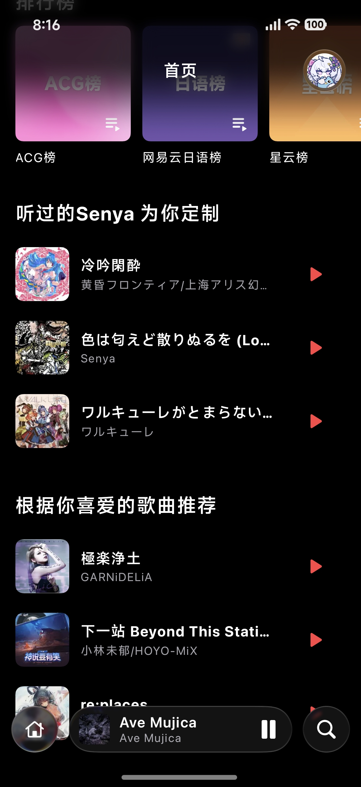</td>
    <td>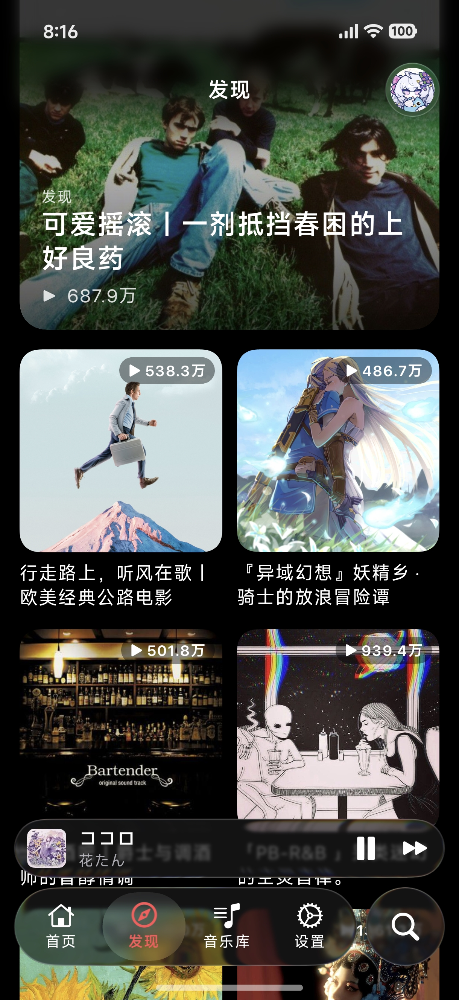</td>
    <td>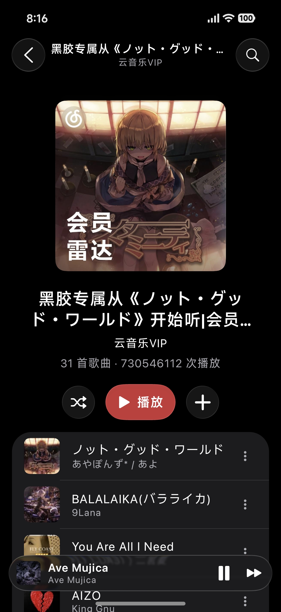</td>
    <td>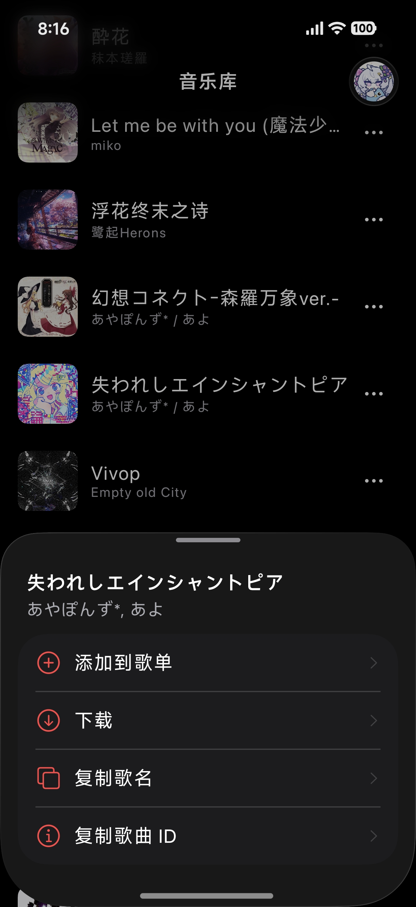</td>
  </tr>
  <tr>
    <td>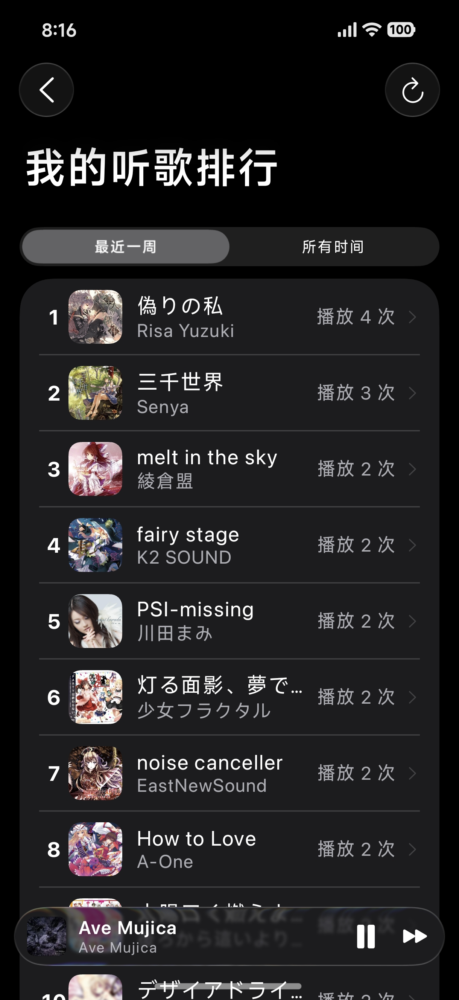</td>
    <td>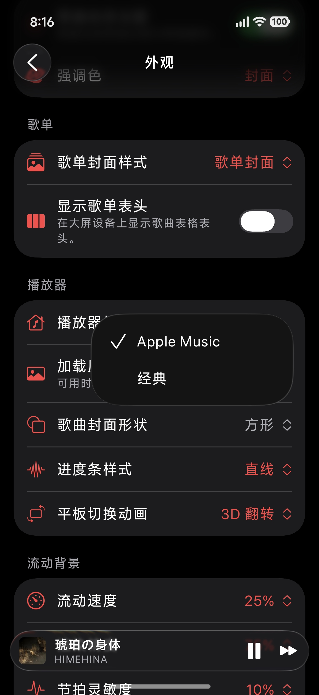</td>
    <td>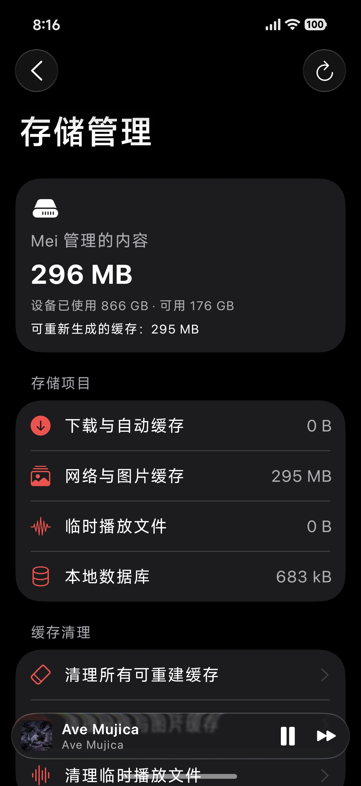</td>
    <td>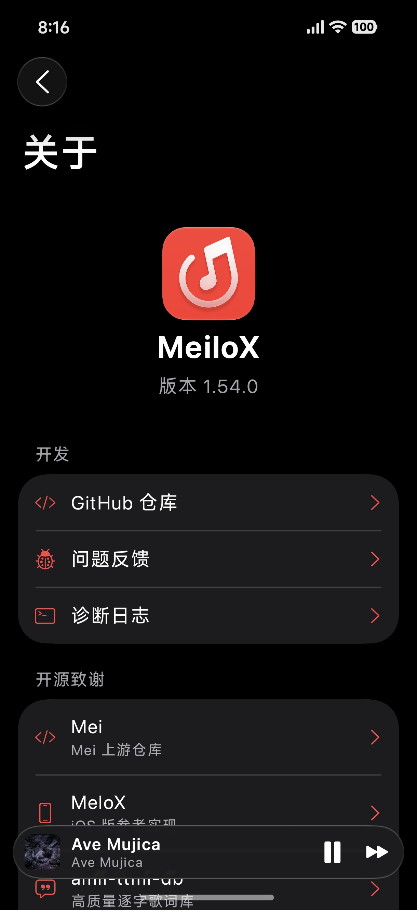</td>
  </tr>
</table>

### 播放器与歌词

<table>
  <tr>
    <td>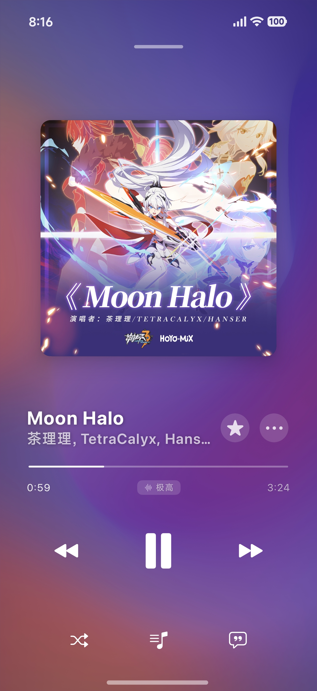</td>
    <td>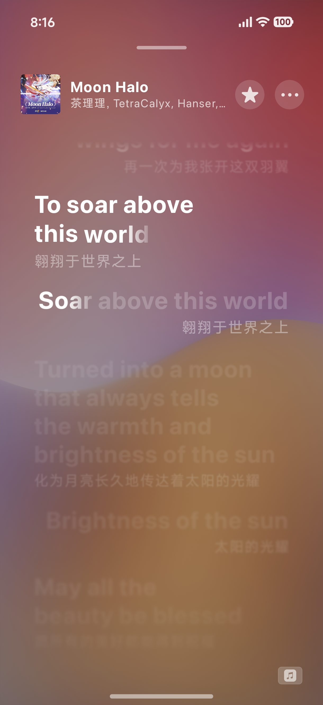</td>
    <td>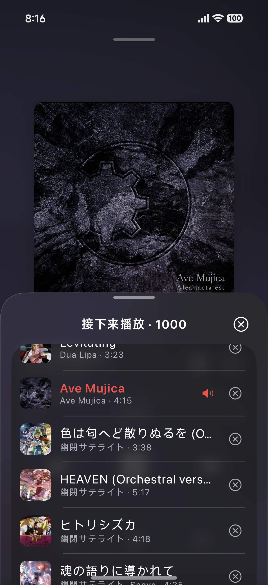</td>
    <td>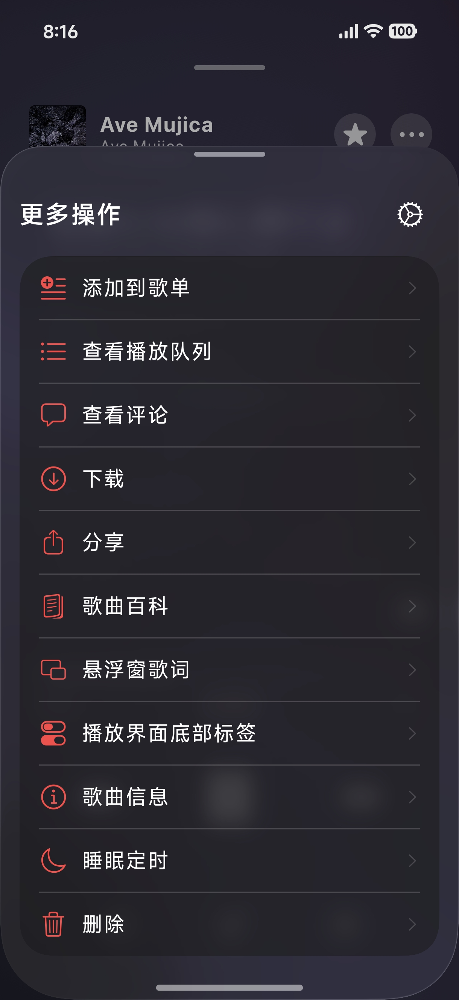</td>
    <td>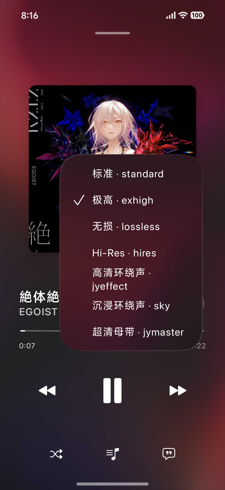</td>
  </tr>
</table>

## 免责声明

本项目仅用于学习、研究和个人使用。使用本项目访问网易云音乐服务时，请遵守当地法律法规、网易云音乐服务条款及相关版权要求。项目维护者不对第三方服务的可用性、账号状态或音乐内容承担责任。

如果你发现侵权内容、许可证遗漏或不准确的第三方声明，欢迎通过 [Issues](https://github.com/NEORUAA/MeiloX/issues) 联系维护者。

Made with Jetpack Compose · MeiloX

